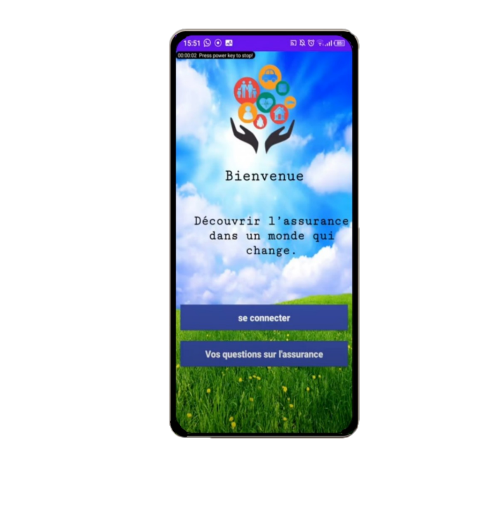

<p align="center">
  
<p>

<h1 align="center">Insurance Online</h1>

<p align="center">
Insurance Online is an Android application designed to manage contract insurance. The application offers two spaces, one for the client and another for the admin. The customer can add, delete, edit and view the contract, while The Admin space boasts a dynamic dashboard for visualizing and managing contract data


## Installation

To install the application, follow these steps:

1. Clone the repository to your local machine using following Git command or download the ZIP file and extract it.
   ```bash
   git clone https://github.com/ayoubxmahmoud/Android_App_Gestion_Contrats_Assurance.git
   ```
2. Open the project in Android Studio.
3. Create a new Firebase project and add the Android app to it. Follow the instructions in the Firebase console to generate a `google-services.json` file for your app.
4. Add the `google-services.json` file to the app folder in the project. Make sure that the file is named exactly `google-services.json` and is located in the app/ directory.
5. Build and run the app on an emulator or a physical device.

## Contributing

Contributions to the application are welcome. If you find any bugs or have any suggestions for improvement, please create an issue or a pull request on the GitHub repository.
